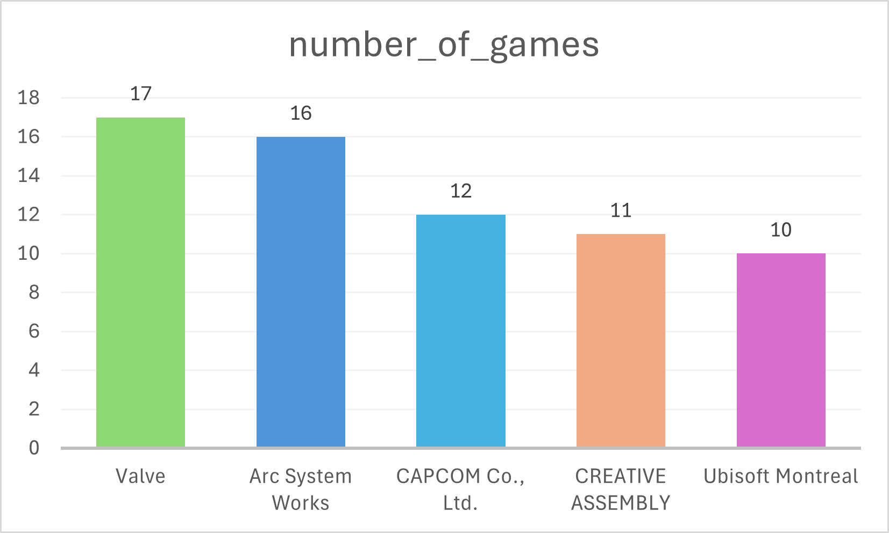

# Best Selling Steam Games
SQL Intermediate 'Practice Loop' mini-project
<br>

### 🧼 Data Cleaning & Manipulation
- I split data into three CSV files based on where the field info came from - game_faqs, steam_main, steam_db. 
- I changed the format of the 'release_date' in Excel - to remove a comma in each row.
- I created a new table with SQL - to separate the multiple genre entries in each row of the 'user_defined_tags' field - named 'game_genres':
- I deleted 10 genre lines from game_genres. 
<br>

## Joins & Aggregates

### JOIN practice

I searched for the 10 game records with missing genre fields, to practice LEFT and RIGHT JOINs. 

```sql 

SELECT m.game_name, 
	g.genre
FROM steam_main AS m
LEFT JOIN game_genres AS g
	ON m.game_name = g.game_name
WHERE g.genre IS NULL; 

```

```sql 

SELECT m.game_name, 
	g.genre
FROM game_genres AS g
RIGHT JOIN steam_main AS m
	ON m.game_name = g.game_name
WHERE g.genre IS NULL; 

```

### Write a query using at least 2 JOINs. 

I searched records with all their game genres present and then filtered for difficulty over 3. 

```sql

SELECT m.game_name, 
	g.genre,
	f.difficulty
FROM steam_main AS m
LEFT JOIN game_genres AS g
	ON m.game_name = g.game_name
INNER JOIN game_faqs AS f
	ON m.game_name = f.game_name
WHERE g.genre IS NOT NULL 
	AND m.game_name IN (
		SELECT f.game_name
		FROM game_faqs AS f
		WHERE f.difficulty > 3
	)
ORDER BY f.difficulty DESC;

```

### Create a summary table using GROUP BY and COUNT/SUM/AVG.

Which developers have produced the most best-selling Steam games? 

```sql
SELECT developer,
	COUNT(developer) AS number_of_games
FROM steam_main
GROUP BY developer
ORDER BY number_of_games DESC
LIMIT 5;
```

<p align="left">
  
</p>

### Include a HAVING clause to filter based on aggregate.

Which genres have over 1 million downloads? 

```sql
SELECT g.genre,
	SUM(d.estimated_downloads) AS total_downloads
FROM game_genres AS g
INNER JOIN steam_db AS d
	ON g.game_name = d.game_name
GROUP BY g.genre
HAVING SUM(d.estimated_downloads) > 1000000
ORDER BY total_downloads DESC; 
```
<br>

## CASE Statements

### Use CASE in a SELECT to create a new category (e.g., “high-rated”, “low-rated”).

```sql
SELECT game_name,
	reviews_like_rate,
	CASE 
		WHEN reviews_like_rate > 49 THEN 'high-rated'
		ELSE 'low-rated'
		END AS rating_category
FROM steam_main
ORDER BY reviews_like_rate DESC;
```

### Use CASE in an ORDER BY to custom sort your results.

Sorting games alphabetically, prioritising those support Japanese. 

```sql
SELECT 
	game_name,
  	CASE 
  		WHEN supported_languages ILIKE '%Japanese%' THEN 'Supports Japanese'
    		ELSE 'Does NOT support Japanese'
  		END AS language_support
FROM steam_main
GROUP BY game_name
ORDER BY CASE 
		WHEN supported_languages ILIKE '%Japanese%' THEN 0
		ELSE 1
		END,
	game_name;
```

### Use CASE inside a WHERE to conditionally filter.

Filtering out games with high prices and low ratings. 

```sql
SELECT game_name,
	price,
	reviews_like_rate
FROM steam_main
WHERE price <
	CASE 
		WHEN reviews_like_rate < 50 THEN 25
		ELSE 45
	END;
```
<br>

## Subqueries

### Write a query with a subquery in the SELECT clause (e.g., compare a value to a group average).

Show downloads for game Rust alongside average price and length across all games. 

```sql
SELECT game_name,
	estimated_downloads,
	(SELECT
		ROUND(AVG(price), 2)
		FROM steam_main) AS average_price_in_$,
	(SELECT
		ROUND(AVG(length), 0)
		FROM game_faqs) AS average_length_in_hours
FROM steam_db
WHERE game_name LIKE 'Rust';
```

### Use a correlated subquery in a WHERE clause to filter based on row-by-row comparison.

Only include games above or equal to the average rating for their developer. 

```sql
SELECT game_name,
	developer,
	reviews_like_rate
FROM steam_main AS outer_table
WHERE reviews_like_rate >= (
	SELECT AVG(reviews_like_rate)
	FROM steam_main AS inner_table
	WHERE inner_table.developer = outer_table.developer
	);
```

### Nest one subquery inside another to produce a derived metric.

Show games with more reviews than the average number of reviews for all games rated over 3.

```sql
SELECT m.game_name,
	m.all_reviews_number
FROM steam_main AS m
INNER JOIN game_faqs AS f
	ON m.game_name = f.game_name
WHERE m.all_reviews_number > (
	SELECT avg_reviews_over_3
	FROM (
		SELECT AVG(m2.all_reviews_number) AS avg_reviews_over_3
		FROM steam_main AS m2
		INNER JOIN game_faqs AS f2
		ON m2.game_name = f2.game_name
		WHERE f2.rating > 3
		)
	);
```
<br>

## CTEs

### Write a CTE to break a long query into parts.

Previous query, restructured. 

```sql
WITH avg_reviews_query AS (
	SELECT AVG(m2.all_reviews_number) AS avg_reviews_over_3
			FROM steam_main AS m2
			INNER JOIN game_faqs AS f2
			ON m2.game_name = f2.game_name
			WHERE f2.rating > 3
			)

SELECT m.game_name,
	m.all_reviews_number
FROM steam_main AS m
INNER JOIN game_faqs AS f
	ON m.game_name = f.game_name
CROSS JOIN avg_reviews_query
WHERE m.all_reviews_number > avg_reviews_query.avg_reviews_over_3;
```

### Chain 2+ CTEs together for multi-step logic.

1. Identify underrated games by niche developers
   - Step 1: Get average rating per developer
   - Step 2: Compare each game's rating to their developer's average
   - Step 3: Filter for games that outperform their dev's average by a big margin

```sql
WITH dev_avg_rating AS (
	SELECT m.developer, ROUND(AVG(f.rating),2) AS avg_rating
	FROM steam_main AS m
	INNER JOIN game_faqs AS f
		ON m.game_name = f.game_name
	GROUP BY m.developer
	),
	
	game_vs_dev AS (
	SELECT f.game_name, m.developer, f.rating, d.avg_rating, f.rating - d.avg_rating AS rating_diff
	FROM steam_main AS m
	INNER JOIN game_faqs AS f
		ON m.game_name = f.game_name		
	INNER JOIN dev_avg_rating AS d
		ON d.developer = m.developer
	GROUP BY f.game_name, d.avg_rating, m.developer
	)

SELECT *
FROM game_vs_dev
WHERE rating_diff > 1.0; 
```


2. Find long, hard games with low download numbers (hidden gems)
   - Step 1: Filter for long and difficult games
   - Step 2: Rank those by estimated downloads
   - Step 3: Pull the least downloaded ones (bottom 20%)

```sql
WITH long_difficult_games AS (
	SELECT f.game_name, f.difficulty, f.length, d.estimated_downloads
	FROM game_faqs AS f
	INNER JOIN steam_db AS d
		ON f.game_name = d.game_name
	WHERE difficulty >= 4 
		AND length >= 60
	),

	ranked_games AS (
	SELECT *, 
		NTILE(5) OVER (ORDER BY estimated_downloads ASC) AS download_tile
	FROM long_difficult_games
	)

SELECT game_name, difficulty, length, estimated_downloads, difficulty + length AS diff_length_total
FROM ranked_games
WHERE download_tile = 1
ORDER BY diff_length_total DESC; 
```


3. Compare average review count for high-rated games by age group
   - Step 1: Filter for games with rating > 4
   - Step 2: Bucket games by age restriction
   - Step 3: Average review count per age bucket

```sql
WITH high_rated AS (
	SELECT f.age_restriction, m.all_reviews_number
	FROM game_faqs AS f
	INNER JOIN steam_main AS m
		ON f.game_name = m.game_name
	WHERE f.rating > 4
	),

	age_restriction_groups AS (
	SELECT 
		CASE 
			WHEN age_restriction < 10 THEN 'Everyone'
			WHEN age_restriction < 13 THEN 'Kids'
			WHEN age_restriction < 17 THEN  'Teen'
			ELSE 'Mature' 
		END AS age_group, 
		all_reviews_number
	FROM high_rated
	)

SELECT age_group, ROUND(AVG(all_reviews_number), 0) AS avg_reviews
FROM age_restriction_groups
GROUP BY age_group
ORDER BY avg_reviews DESC; 
```

### Use a CTE + final SELECT that aggregates or joins the intermediate data.

What percentage of the top games are Mature (17+) age-restricted? 

```sql
WITH mature_games AS (
	SELECT game_name, 
		age_restriction
	FROM game_faqs
	WHERE age_restriction >= 17
),

	total_games AS (
	SELECT COUNT(*) AS total_count
	FROM game_faqs
)

SELECT COUNT(*) AS mature_count,
	ROUND(100.0 * COUNT(*) / t.total_count, 0) AS mature_percentage
FROM mature_games AS m
CROSS JOIN total_games AS t
GROUP BY t.total_count; 
```

## Window Functions

### Use RANK() or DENSE_RANK() to rank items within categories.

Which 10 games are ranked highest? 

```sql
SELECT game_name, 
	rating, 
	RANK() OVER(ORDER BY rating DESC) AS rating_rank
FROM game_faqs
LIMIT 10; 
```

### Use LAG() or LEAD() to compare a row to the previous/next.

Does each developers' game ratings get better or worse over time? 

```sql
SELECT m.game_name,
       m.developer,
	   m.release_date,
	   f.rating,
       LAG(f.rating) OVER (PARTITION BY m.developer ORDER BY m.release_date) AS previous_rating_by_same_dev,
	   CASE 
	   		WHEN LAG(f.rating) OVER (PARTITION BY m.developer ORDER BY m.release_date) < f.rating THEN 'higher'
			WHEN LAG(f.rating) OVER (PARTITION BY m.developer ORDER BY m.release_date) > f.rating THEN 'lower'
			WHEN LAG(f.rating) OVER (PARTITION BY m.developer ORDER BY m.release_date) IS NULL THEN 'N/A'
	   		ELSE 'same' 
			  END AS higher_or_lower
FROM steam_main AS m
INNER JOIN game_faqs AS f
	ON m.game_name = f.game_name;
```

### Use a cumulative function like SUM() OVER(...) to track running totals or trends.
